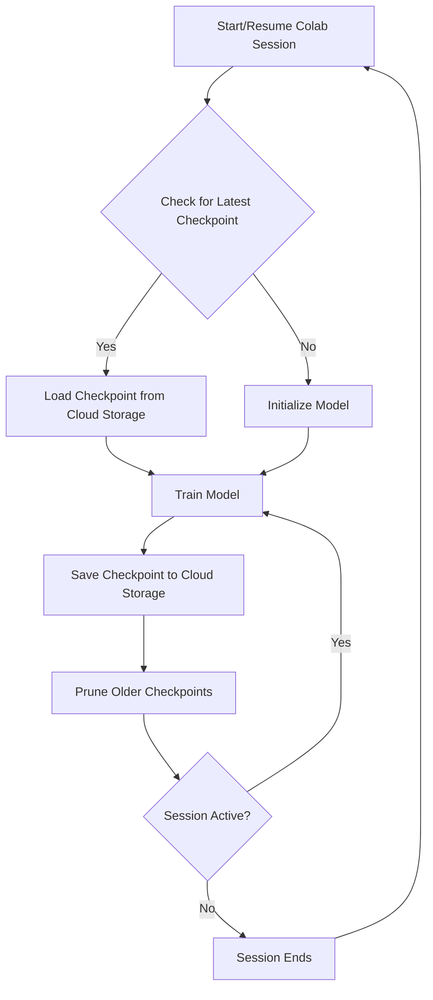

# Hindi-to-English-Transformer-Based-NMT
Translating texts from Hindi to English using the Transformer model

## Datasets
Original Data: http://www.cfilt.iitb.ac.in/iitb_parallel/

Processed Data (without Back-Translation): https://drive.google.com/drive/folders/1JbNs2V8RTyN9lDGxms0IGENmFROxhJRi?usp=sharing

# ☁️ Cloud Training Pipeline

This project’s training pipeline was engineered to fully leverage free-tier cloud compute, specifically Google Colab, for large-scale neural machine translation model training.

## Overview

The pipeline addresses the inherent limitations of free cloud resources—such as session timeouts, limited storage, and disconnections—by introducing robust automation and recovery mechanisms:

- **Automatic Checkpointing:** Model checkpoints are saved at regular intervals to persistent cloud storage (e.g., Google Drive).
- **Seamless Resumption:** Training can resume automatically from the latest checkpoint after any Colab disconnection or runtime reset.
- **Auto-Pruning:** Older checkpoints are automatically deleted to optimize storage usage and prevent quota overruns.
- **Cost-Efficiency:** The entire workflow operates at virtually zero cost, completing large-scale training in under 24 hours.

## Pipeline Diagram

## Key Steps

- **Session Start/Resume:** Upon launching a Colab session, the pipeline checks for the latest checkpoint in cloud storage.
- **Checkpoint Handling:** If found, training resumes from the last checkpoint; otherwise, a new model is initialized.
- **Training & Saving:** The model trains for the available session duration, saving checkpoints at regular intervals.
- **Auto-Pruning:** Older checkpoints are deleted, retaining only the most recent ones to manage storage efficiently.
- **Session Recovery:** If the session ends, simply restarting the notebook resumes training from the last checkpoint.

## Why This Matters

- **Overcomes Cloud Runtime Limits:** No progress is lost due to session timeouts or disconnections.
- **Maximizes Free Resources:** Enables large-scale training without premium cloud costs.
- **Efficient Storage Management:** Prevents storage overflow and ensures uninterrupted training.

## Results
Obtained a state-of-the-art BLEU score of 24.53 for Hindi to English translations on test set having 2478 records.
